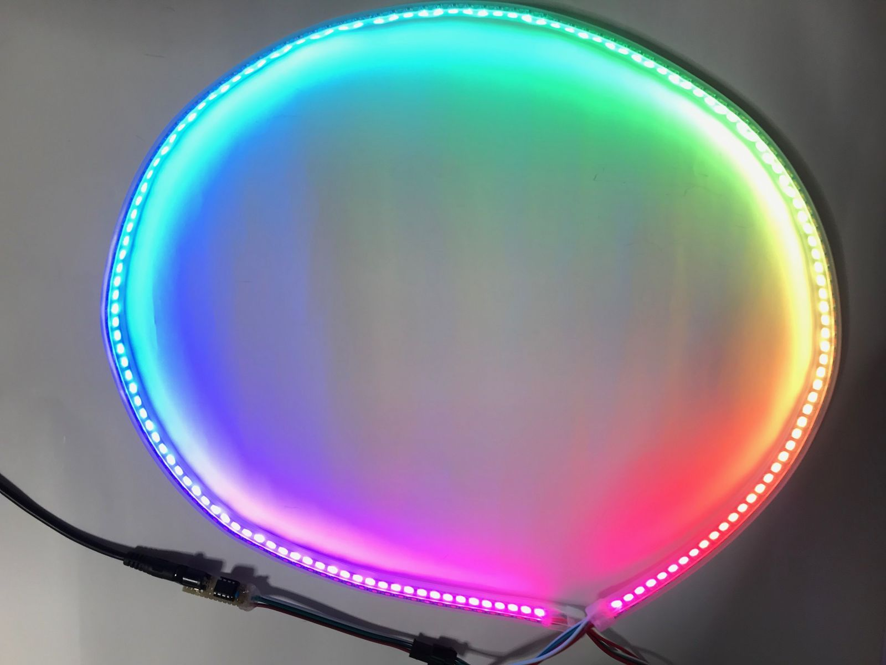

# WS2812B搭載LEDテープの振り子回転LED
わずか8ピンの8bitマイコンPIC16F18313を使用して、WS2812B搭載のLEDテープ（NeoPixel）上で色相環を回転させるプログラムです。  
単に回転するだけでは面白くないので、振り子のように手を離した瞬間はゆっくり回転し、だんだん速度を増した後また速度を落とし始め、やがて逆回転となるように制御しました。  
こちらでツイッターで紹介した動画を見ることができます。  
https://twitter.com/KenKenMkIISR/status/1522066939220471808  
  
  
## 公開プログラム
8ビットマイコンPIC16F18313向けにMicrochip Code ConfiguratorとXC8コンパイラを使用して作成しました。  
main.cおよびmcc_generated_filesディレクトリ上の全てのソースファイルとヘッダファイルをMPLAB Xのプロジェクトに追加して、ビルドしてください。念のためLED数144個の時のHEXファイルを公開していますので簡単にお試しいただけます。  
  
各種パラメータを変更することで動きを変更することができます。  
LEDの数はLED_NUMで変更可能です（初期値は144）。必ず3の倍数とする必要があります。また明るさの設定計算で手抜きをしているので、LEDの数を変更すると明るさが変わります。必要に応じてled_r、led_g、led_bの計算結果に適当な係数をかけてください。（それぞれ1ビット～2ビット左シフトさせるなど。）  
  
## 接続方法
電源はLEDに対して十分な容量のものを用意してください。  
  
PIC　　NeoPixel  
VDD -- +5V  
VSS -- GND  
RA5 -- DIN  
※PICの空きピンには何も接続しないでください。  
  
## 利用について
本プログラムは公共の場を含め、誰でも自由にご利用いただけます。  
改変も可能です。ぜひご活用ください。
